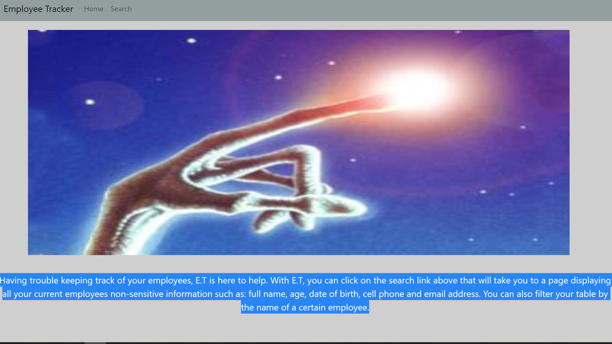
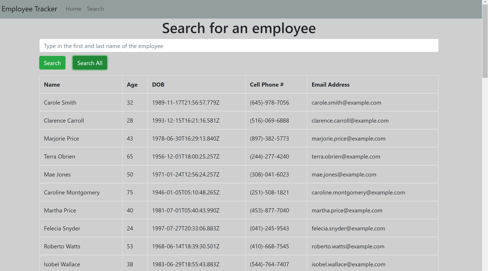
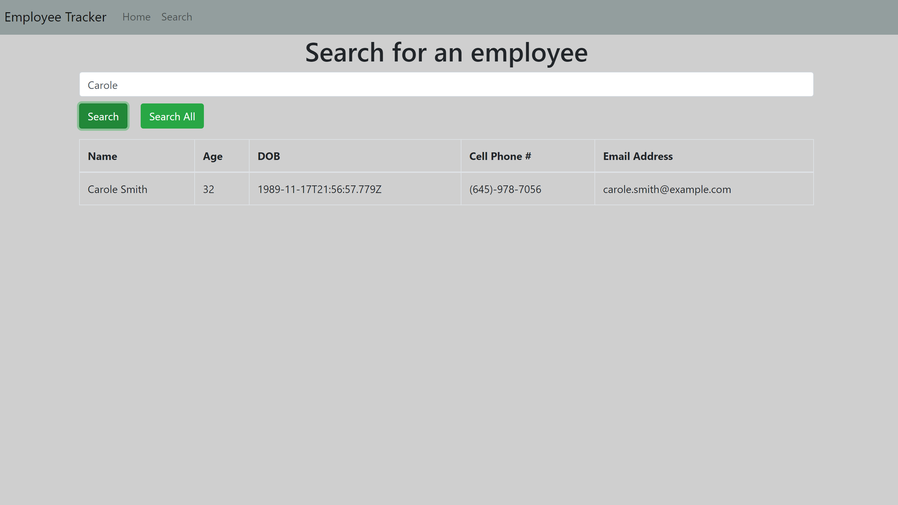

# E.T - Employee Tracker

## Table of Contents 

[Description](#description)

[Tech Used](#tech_used)

[Screenshots](#screenshots)

[Link to deployed app](#link)

[Questions](#questions)

## Description 

Having trouble keeping track of your employees, E.T is here to help. With E.T, you can click on the search link above that will take you to a page displaying all your current employees non-sensitive information such as: full name, age, date of birth, cell phone and email address. You can also filter your table by the name of a certain employee.

## Tech Used

* React
* React Bootstrap
* React Router
* Axios

## Screenshots

## Link 
[Link to deployed GitHub app](https://lavina91.github.io/employee-tracker)

